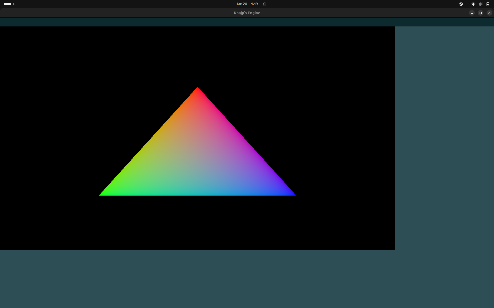

# Knajp's Engine

I really couldn't think of a better name.

A non-voxel (though possible voxel implementation in the future) game engine, mostly for personal use. Started to expand Vulkan knowledge, create a powerful tool and have fun and tackle challenges along the way. 

## Progress
Currently at: Introducing a basic CS raytracer.

Finished: Scene demo.

Most recent demo:

